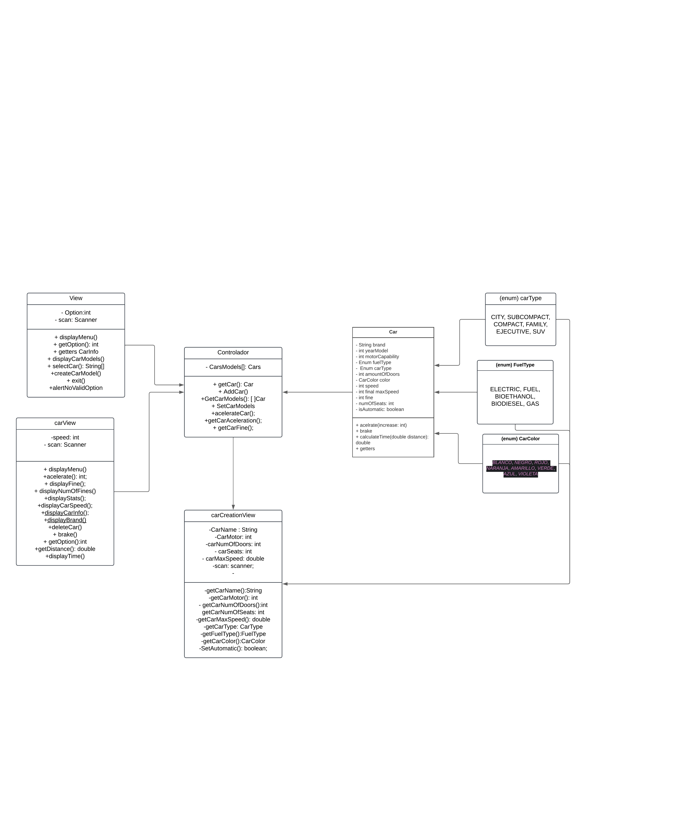

# Concesionario
This repo allows you to create different models for vehicles and acelerate it, also, when the vehicle exceed the speed limit you´ll get a fine 

Diagramm UML:

[See in the web](https://lucid.app/lucidchart/10104b88-b05a-4461-aaaf-8fa9c62034be/edit?viewport_loc=-2882%2C-43%2C1398%2C612%2C0_0&invitationId=inv_1256a291-0dd5-4eef-8a72-0746edf1ceaa)